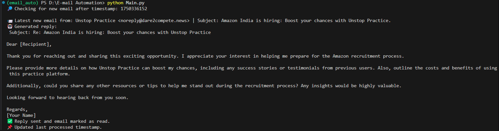

# Email Auto-Reply Bot (Gmail + AI)

This project automatically reads unread Gmail messages and generates smart replies using Cohere AI.

## Features
- Gmail API integration (OAuth2)
- AI-generated replies via Cohere
- Timestamp tracking to avoid duplicate replies
- Free-tier-friendly and easy to extend

## Setup
1. Create a `.env` file with:
2. Run `Token_Gen.py` to authorize Gmail.
3. Run `Main.py` to process the latest new email.

## Requirements
- Python 3.8+
- `pip install -r requirements.txt`

## 📸 Screenshots

### 🔹 Terminal Output

>>>>>>> 10e7cf93ef1a27f5ae303a395305b83b310d05a0
